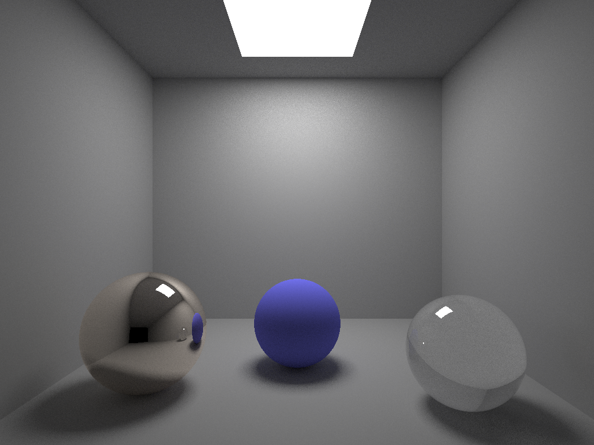
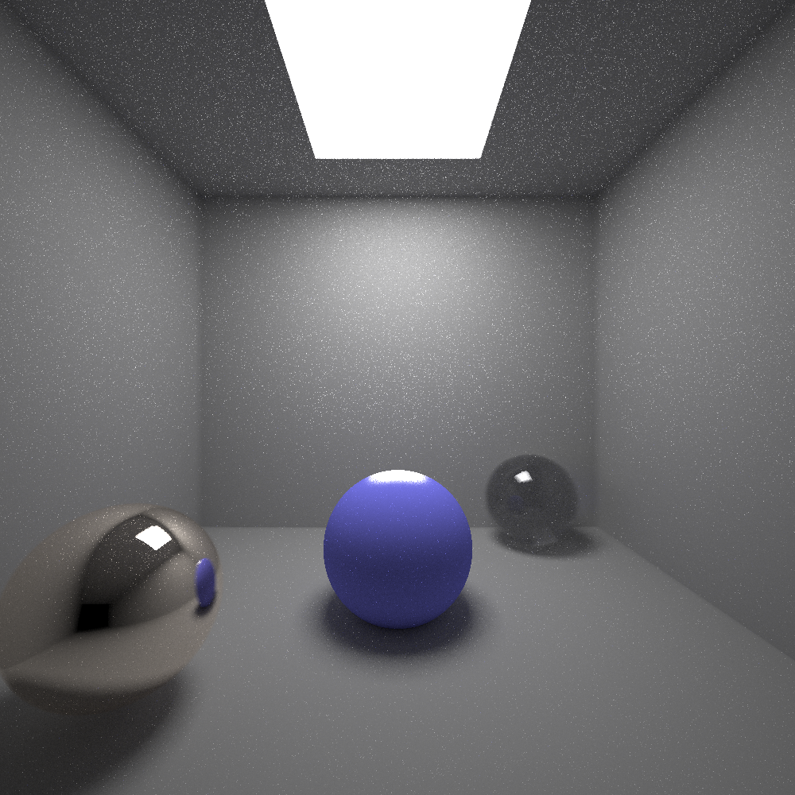

## CS-GY 6533  Monte Carlo Ray Tracing with OpenGL

Lynn Li (`ml6589`)

Overview of deliverables 

1. Monte Carlo Ray Tracing Spheres - Support the rendering of multiple spheres and 3d triangle meshes in general position with Monte Carlo ray tracing techniques.
2. Shading - Support ambient and specular lighting from an area light source. Render the scene with multiple objects with different colors and different material properties including purely diffuse, glass and mirror surface.
3. Shadow - Add soft shadows casted on the object as well as surrounding environment (wall/ floor). 
4. Depth of Field effect 
5. Refraction - Since I plan to use rough floor to present best effect of Monte Carlo integration, I will add refraction on the floor, wall and 3d object with rough surfaces. 
6. Simple parallelization for faster rendering with OpenMP 
7. Animation - Create a simple animation by rendering multiple frames while moving the position of the camera and of the object. 

**<u>Compilation Instruction</u>**

```
cd Final
mkdir build
cd build
cmake -DCMAKE_BUILD_TYPE=Release ../ 
make
```

<u>**Input**</u>

File name

<u>**Implementation**</u>

**1.1 Monte Carlo Ray Tracing** 

1. For each pixel, cast a ray

```c++
 for (int i=0;i< C_r.rows(); i++)
	{
		// Parallellize the for loop with openMP.
		for (int j = 0; j< C_r.cols(); j++)
		{
			for (int k = 0; k < SAMPLES; k++) 
        // SAMPLES is a const for Monte Carlo Sampling
			{
        Cast a ray in Camera class
        Trace the ray
      }
      calculate average
			map color stored in matrix to each pixel
		}
```

2. Depth of field implementation

   - Get a random number as x_offset in range [-aperture/2, aperture/2]

   - Calculate y_offset with aperture and x_offset
     - x_offset^2 + y^offset = aperture^2
   - Calculate the ray direction with pixel position and eye position
   - Calculate a new focal aim
     - new aim = eye + k*ray direction (k is a float that decides the focus plane)
   - Set the new ray origin as (eye[0] + x_offset, eye[1] + y_offset, eye[2])
   - Set the new ray direction as normalize( focal aim - eye)

3. Trace the ray

   - function trace_ray()

     if : no intersection with any object

     ​	 or intersect with light source 

     ​	or escape condition is met (iterated over 25 times)

     then return empty color;

     else

     ​	(t, N, material) ← intersect (scene, ray)

     ​	if intersect_pt.material is not transmissive

     ​		if specular_reflectance is 1 // mirror

     ​			trace ideal reflection (recursive function)

     ​		if material is matte

     ​			calculate diffuse = direct diffuse (lambertian BRDF/ Phong BRDF)+ indirect diffuse (random sampling on hemisphere then call trace_ray recursively)

     ​		if glass

     ​			trace refracted ray recursively

     return I end function

4. Area Light

   - Cast shadows rays to different location of the light, see if it is intersecting with the emitter plane
   - radiosity = flux/area





